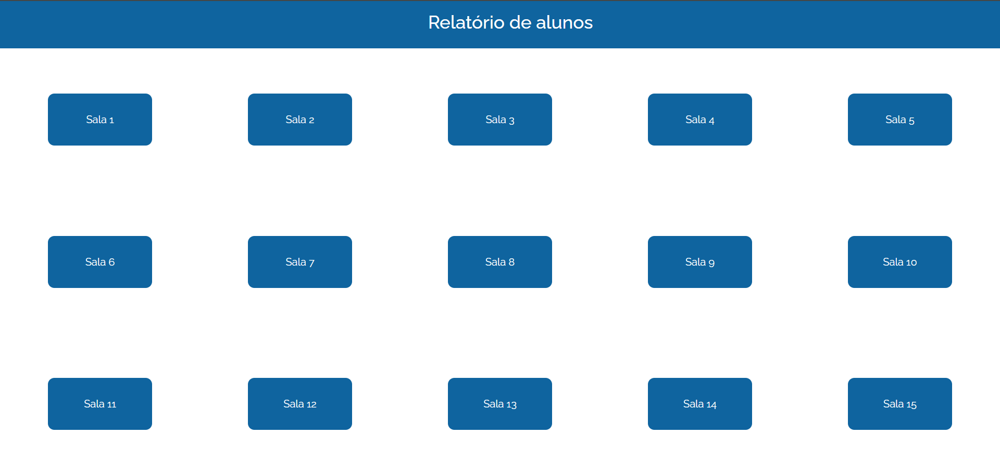

## 📘 Sistema de Relatórios de Alunos

Aplicação web desenvolvida com Flask, SQLite e python-docx para geração automática de relatórios de alunos a partir de dados armazenados em banco.

🚀 Funcionalidades

- Consulta de alunos no banco SQLite

- Exibição de dados em interface web

- Geração automática de relatórios em Word

- Arquitetura modular (routes, queries, report)

- Interface simples e funcional

🛠️ Tecnologias Utilizadas

- Python 3

- Flask

- SQLite

- Python-docx

- HTML/CSS/Bootstrap

- Jinja2

▶️ Como executar

Instale as dependências:

pip install -r requirements.txt

Rode o servidor Flask:

python run.py

Acesse no navegador:

http://127.0.0.1:5000/

🔗 Demonstração Online

👉 relatorio-alunos.onrender.com

👤 Autor

Igor Verneque
Desenvolvedor Python • Flask • Web • SQL
